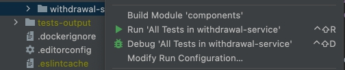
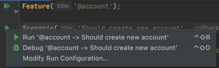
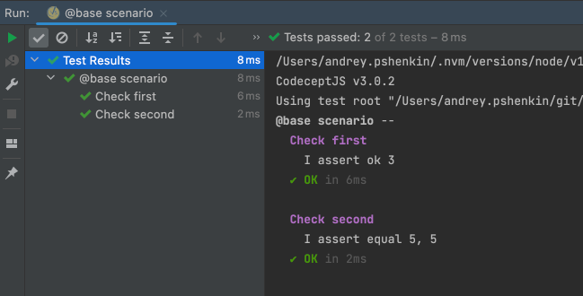
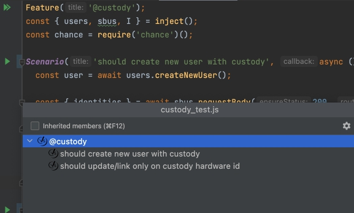

# IntelliJ Codeceptjs integration plugin
Integrates <b>Codecept.io</b> under the common Intellij test framework.

## Credits
Big thanks for [Mikhail Bolotov](https://github.com/mbolotov) for reference implementation from [Cypress](https://github.com/mbolotov/intellij-cypress/)

## Compatibility
As the plugin depends on *JavaLanguage* and *NodeJS* plugins, so it requires a commercial version of IDEA (Ultimate, WebStorm etc) 
## Install
Plugin can be installed from the Jetbrains Marketplace. Open '*Settings/Preferences* -> *Plugins*' menu item and type '**Codeceptjs**' in the search bar. See [here](https://www.jetbrains.com/help/idea/managing-plugins.html) for details. Please note that base and Pro versions are not expected to run together so you should disable or uninstall one of them to use the other. 
## Usage
Brief video overview: https://www.youtube.com/watch?v=1gjjy0RQeBw 
### Test run configurations
Plugin introduces a dedicated Codeceptjs [run configuration](https://www.jetbrains.com/help/idea/run-debug-configuration.html) type
You can create a run config from either file view (directory, spec file) or directly from the code

file view | code view 
------------ | -------------
 | 

### Running tests
Just start your configuration. You can watch test status live on the corresponding tab:   


You can navigate from a test entry in the test tab to the source code of this test just by clicking on it.<br>

### File Structure
Your tests now are displayed in IDEA File Structure tab, where you can quick navigate and use fuzzy search


### Limitations:
1. [Data Driven Tests](https://codecept.io/advanced/#data-driven-tests) run configuration allow you only to run all cases with all data sets. This is because data can be any js object, and it's hard to get access to final string that will be added to test name. If you have ideas, how to implement this, you are welcome to create PR for it 🙃

## Build plugin from the sources
```bash
./gradlew buildPlugin
````
## Run
Either start IDE bundled with plugin via gradle:
```bash
./gradlew runIde
```                                             
Or install built plugin manually in the Settings->Plugin section of IDEA

Path to jar : `intellij-codeceptjs/build/libs/intellij-codeceptjs-1.0.jar`
